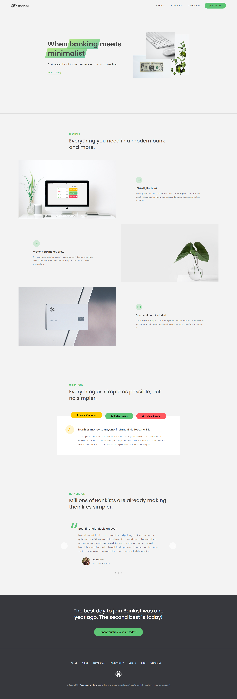

# Bankist Website (Vanilla JavaScript)

🔗 **Live Demo:** https://bankist-website-js-w-j.netlify.app/

A modern, interactive landing page built using **vanilla JavaScript**, focusing on DOM manipulation, smooth UI interactions, and performance optimization — without using any frameworks or libraries.

---

## 🚀 Features

- **Modal Window**  
  Open and close modal using buttons, overlay click, and `Escape` key handling.

- **Smooth Scrolling**  
  Smooth scroll to specific sections using `scrollIntoView()`.

- **Page Navigation (Event Delegation)**  
  Efficient navigation by attaching a single event listener to the parent container.

- **Tabbed Component**  
  Dynamic tab switching using `data-*` attributes and event delegation.

- **Menu Fade Animation**  
  Navigation links fade on hover using `mouseover` and `mouseout` events with `bind()`.

- **Sticky Navigation**  
  Sticky header implemented using the **Intersection Observer API** for better performance.

- **Section Reveal on Scroll**  
  Sections are revealed smoothly when they enter the viewport using the **Intersection Observer API** for better performance.

- **Lazy Loading Images**  
  Images load only when near the viewport to improve performance and page speed using the **Intersection Observer API**.

- **Slider / Carousel**  
  Interactive slider with:
  - Next & Previous buttons
  - Dot navigation
  - Keyboard arrow key support

---

## 🧠 JavaScript Concepts & Techniques Used

- DOM manipulation and traversal
- Event delegation
- Closures and modular functions
- Intersection Observer API
- `data-*` attributes
- Performance optimization techniques
- Keyboard and mouse event handling
- CSS transforms for animations

---

## 🛠 Tech Stack

- **HTML5**
- **CSS3**
- **Vanilla JavaScript (ES6+)**

---

## 🎯 Project Purpose

This project was built to:

- Strengthen core **JavaScript fundamentals**
- Practice **real-world UI interactions**
- Learn modern **browser APIs**
- Improve performance-focused front-end development skills

---

## 📷 Preview

---

## 👨‍💻 Author

**Md. Asaduzzaman Rana**  
Front-End Developer  
Skilled in JavaScript, React.js, and Next.js

---
